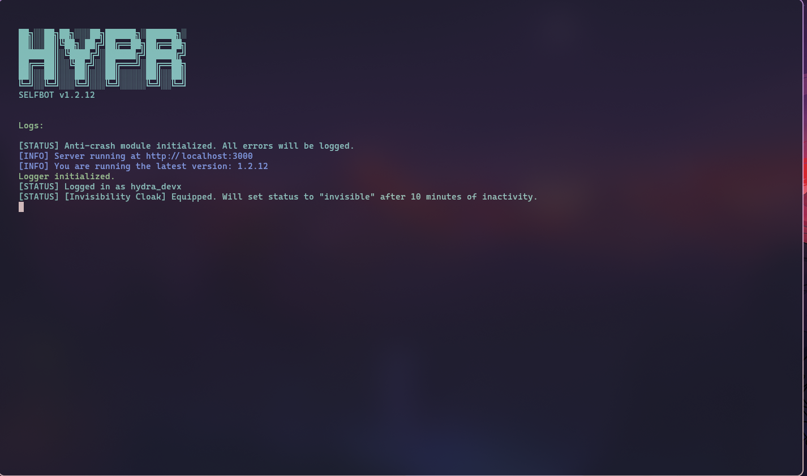
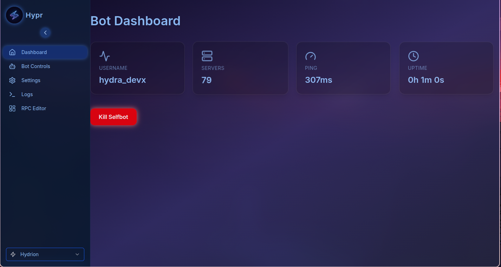

<p align="center">
  
</p>

<h1 align="center">⚡ Hypr-S3LFB0T</h1>

<p align="center">
  <strong>The ultimate, modular Discord selfbot framework by <a href="https://github.com/Hydradevx">@Hydradevx</a></strong><br/>
  <a href="https://discord.gg/6Tufbvnebj">🌐 Support Server</a> • <a href="https://hydrion.netlify.app">📘 Documentation</a>
</p>

<p align="center">
  
</p>

---

## ⚠️ Legal Disclaimer

> **Selfbots are against [Discord's Terms of Service](https://discord.com/terms).**
> By using this project, you acknowledge that you take full responsibility for any risks involved.
> The creators and contributors of Hypr are **not liable for account bans, suspensions, or any misuse.**

---

## ✨ Features

- ⚡ **Blazing-fast** cross-platform setup
- 🧩 **Fully modular** command and plugin system
- ⚙️ Powerful `config.json` with hot reload support
- 🌐 Modern **Web UI** (optional)
- 🎮 **Discord RPC** integration
- 🔁 **Auto-reactions**, message utilities & more
- 📦 Ready for plugin-based extensions
- 🛠️ Active development & support

---

## 🖼️ Previews

<p align="center">
  
  
</p>

---

## 📘 Documentation

Get started, configure features, and view usage examples:
👉 [**hydrion.netlify.app**](https://hydrion.netlify.app)

---

## 🧪 Quick Start

```bash
git clone https://github.com/Hydradevx/Hypr.git
cd Hypr
pnpm install
pnpm run config
pnpm start
```

---

## 💬 Get Support

Need help? Found a bug? Want to contribute?

- [Open an Issue](https://github.com/Hydradevx/Hypr/issues)
- [Join the Discord Server](https://discord.gg/6Tufbvnebj)

---

## ⭐ Show Your Support

- ⭐ Star this repository
- 🤝 Contribute to the project
- 📣 Share with others

---

<p align="center">
  <b>Crafted with ⚡ by <a href="https://github.com/Hydradevx">Hydradevx</a></b>
</p>
